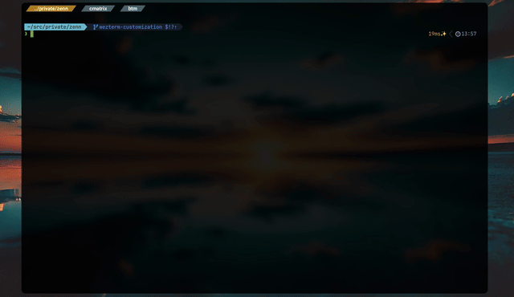
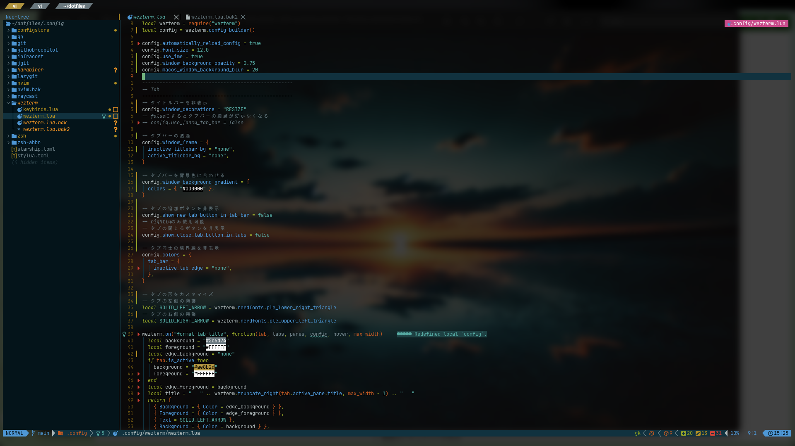

<!-- markdownlint-disable-line -->

# Dotfiles




## 


## Tools

- terminal: [wezterm](https://wezfurlong.org/wezterm/index.html)
- shell: [zsh](https://www.zsh.org/)
- editor: [Neovim](https://neovim.io/)

  

### Settings

- wezterm  
  [.config/wezterm](https://github.com/mozumasu/dotfiles/tree/main/.config/wezterm)
- zsh  
  [.config/zsh](https://github.com/mozumasu/dotfiles/tree/main/.config/zsh)
- Neovim  
  [.config/nvim](https://github.com/mozumasu/dotfiles/tree/main/.config/nvim)


## Articles

- [💘How to setup wezterm](https://zenn.dev/mozumasu/articles/mozumasu-wezterm-customization)

```text


                               .---\         "MMMMN,     #MM#.
                              /     \         "MMMMM,   MMMMM7
                               \     \         "MMMMM,vMMMMM"
                                \     \         "MMMMMMMMMM"
                          .------?     4--------\"MMMMMMMM"
                         /                       \"MMMMM4      /\
                        /_________________________\"MMMMM.    /  \
                                .MMMMM"             "MMMMM.  /    \
                               .MMMMM"               "MMMMM,/      /
                              .MMMMM"                 "MMMM/      /
                             .MMMMM"                   "MM/      /
                    MMMMMMMMMMMMMM"                     "/      4------.
                   pMMMMMMMMMMMMM",                     /               '
                    NMMMMMMMMMMM"/ \                   /      _________/
                         ,#MMMM"/   \                 /      /
                        ,MMMMM"/     \               /      /
                       "MMMMM"  \     \             /______/
                        "MMM"    \     \"MMMMMMMMMMMMMMMMMMMMMMMMMP
                         "M"     /      \"MMMMMMMMMMMMMMMMMMMMMMMP
                          "     /        \"MMMMMMMMMMMMMMMMMMMMMP
                               /          \         "NMMMM,
                              /     /\     \         "NMMMMM
                             4     /  \     \         "NMMMM"
                              \___/    \_____\         "NMM"

                                     ███╗   ██╗██╗██╗  ██╗
                                     ████╗  ██║██║╚██╗██╔╝
                                     ██╔██╗ ██║██║ ╚███╔╝
                                     ██║╚██╗██║██║ ██╔██╗
                                     ██║ ╚████║██║██╔╝╚██╗
                                     ╚═╝  ╚═══╝╚═╝╚═╝  ╚═╝

```

---

## Setup (New Mac)

### Prerequisites

- macOS (Apple Silicon)
- Git

### Installation

```bash
# 1. Install Nix
sh <(curl --proto '=https' --tlsv1.2 -L https://nixos.org/nix/install)

# 2. Clone dotfiles
git clone https://github.com/mozumasu/dotfiles ~/dotfiles

# 3. Backup existing shell configs (first time only)
sudo mv /etc/bashrc /etc/bashrc.before-nix-darwin
sudo mv /etc/zshrc /etc/zshrc.before-nix-darwin

# 4. Apply nix-darwin configuration (first time)
# Note: sudo is required for system activation, but HOME must be preserved
sudo env "HOME=$HOME" nix run \
  --extra-experimental-features nix-command \
  --extra-experimental-features flakes \
  nix-darwin -- switch --flake "$HOME/dotfiles/.config/nix#geisha"

# After initial setup, use:
# nix-switch (or darwin-rebuild switch --flake ~/dotfiles/.config/nix#geisha)
```

> Homebrew is automatically installed via [nix-homebrew](https://github.com/zhaofengli/nix-homebrew)

### What's Managed by Nix

| Category | Description |
|----------|-------------|
| **Homebrew** | Auto-installed via nix-homebrew |
| **CLI Tools** | 75+ packages via home-manager |
| **GUI Apps** | 43 Casks via Homebrew |
| **Brew Packages** | 99 formulae |
| **Dotfiles** | nvim, zsh, wezterm, karabiner, etc. |
| **macOS Settings** | Dock, Finder, Keyboard, Trackpad, etc. |

### Manual Setup Required

| Item | Reason |
|------|--------|
| Apple ID | Security |
| App Logins | Authentication |
| SSH Keys | `~/.ssh/` not managed |
| AWS/Git Credentials | Sensitive data |
| Karabiner Permissions | Accessibility permissions |

### Daily Commands

```bash
# Apply configuration changes
nix-switch

# Update flake inputs
nfu

# Garbage collection
ngc
```

---

## Commit Message

```sh
npx czg --api-key="ghp_xxxxxx" --api-endpoint="https://models.inference.ai.azure.com" --api-model="gpt-4o-mini"
```

> [OpenAI | cz-git](https://cz-git.qbb.sh/recipes/openai)
