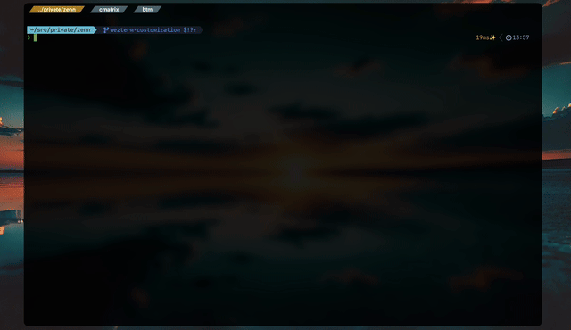
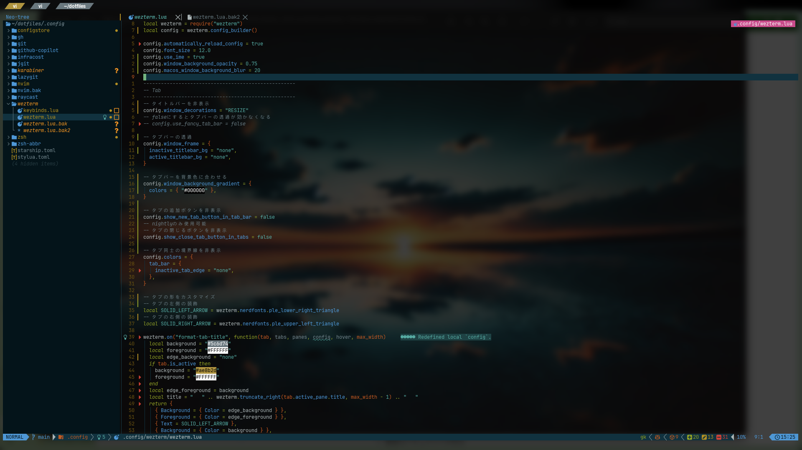

<!-- markdownlint-disable-line -->

# Dotfiles




## 


## Tools

- terminal: [wezterm](https://wezfurlong.org/wezterm/index.html)
- shell: [zsh](https://www.zsh.org/)
- editor: [Neovim](https://neovim.io/)

  

### Settings

- wezterm  
  [.config/wezterm](https://github.com/mozumasu/dotfiles/tree/main/.config/wezterm)
- zsh  
  [.config/zsh](https://github.com/mozumasu/dotfiles/tree/main/.config/zsh)
- Neovim  
  [.config/nvim](https://github.com/mozumasu/dotfiles/tree/main/.config/nvim)


## Articles

- [💘How to setup wezterm](https://zenn.dev/mozumasu/articles/mozumasu-wezterm-customization)

## Scripts

- [📅 Raycast Today Suite](docs/raycast-today-suite.md) — 今日の予定 / close した issue / サマリをクリップボードにコピー

```text


                               .---\         "MMMMN,     #MM#.
                              /     \         "MMMMM,   MMMMM7
                               \     \         "MMMMM,vMMMMM"
                                \     \         "MMMMMMMMMM"
                          .------?     4--------\"MMMMMMMM"
                         /                       \"MMMMM4      /\
                        /_________________________\"MMMMM.    /  \
                                .MMMMM"             "MMMMM.  /    \
                               .MMMMM"               "MMMMM,/      /
                              .MMMMM"                 "MMMM/      /
                             .MMMMM"                   "MM/      /
                    MMMMMMMMMMMMMM"                     "/      4------.
                   pMMMMMMMMMMMMM",                     /               '
                    NMMMMMMMMMMM"/ \                   /      _________/
                         ,#MMMM"/   \                 /      /
                        ,MMMMM"/     \               /      /
                       "MMMMM"  \     \             /______/
                        "MMM"    \     \"MMMMMMMMMMMMMMMMMMMMMMMMMP
                         "M"     /      \"MMMMMMMMMMMMMMMMMMMMMMMP
                          "     /        \"MMMMMMMMMMMMMMMMMMMMMP
                               /          \         "NMMMM,
                              /     /\     \         "NMMMMM
                             4     /  \     \         "NMMMM"
                              \___/    \_____\         "NMM"

                                     ███╗   ██╗██╗██╗  ██╗
                                     ████╗  ██║██║╚██╗██╔╝
                                     ██╔██╗ ██║██║ ╚███╔╝
                                     ██║╚██╗██║██║ ██╔██╗
                                     ██║ ╚████║██║██╔╝╚██╗
                                     ╚═╝  ╚═══╝╚═╝╚═╝  ╚═╝

```

---

## Setup (New Mac)

### Installation

```bash
# 1. Install Nix
sh <(curl --proto '=https' --tlsv1.2 -L https://nixos.org/nix/install)

# 2. Clone dotfiles (use nix-shell if git is not installed)
nix-shell -p git --run "git clone https://github.com/mozumasu/dotfiles ~/dotfiles"

# 3. Backup existing shell configs (first time only)
sudo mv /etc/bashrc /etc/bashrc.before-nix-darwin
sudo mv /etc/zshrc /etc/zshrc.before-nix-darwin

# 4. Apply nix-darwin configuration (first time)
# Note: $HOME is expanded before sudo runs, so the path is correct
# Replace <hostname> with a key from "Available Hosts" below
sudo nix run \
  --extra-experimental-features nix-command \
  --extra-experimental-features flakes \
  nix-darwin -- switch --flake "$HOME/dotfiles/.config/nix#<hostname>"

# After initial setup, use:
# nix run ~/dotfiles/.config/nix#switch <hostname>
```

> The first `switch` clones the private `nb-home` repo. Put `~/.ssh` (and `~/.config/sops/age/keys.txt`) in place first,
> or the clone is skipped with a warning and you re-run `switch` after the keys are set up.

> Homebrew is automatically installed via [nix-homebrew](https://github.com/zhaofengli/nix-homebrew)

### Available Hosts

| Host | Description |
| ------ | ------------- |
| `geisha` | Main Mac |
| `bourbon` | Second Mac |
| `mocha` | Work Mac (`isWork = true`) |
| `robusta` | WSL (home-manager only, `nix run .#switch` on Linux) |

### What's Managed by Nix

| Category | Description |
| ---------- | ------------- |
| **Homebrew** | Auto-installed via nix-homebrew |
| **CLI Tools** | 75+ packages via home-manager |
| **GUI Apps** | 43 Casks via Homebrew |
| **Brew Packages** | 99 formulae |
| **Dotfiles** | nvim, zsh, wezterm, karabiner, etc. |
| **macOS Settings** | Dock, Finder, Keyboard, Trackpad, etc. |

### Manual Setup Required

| Item | Reason |
| ------ | -------- |
| Apple ID | Security |
| App Logins | Authentication |
| SSH Keys | `~/.ssh/` not managed (also used for commit signing) |
| age key | `~/.config/sops/age/keys.txt` decrypts every sops secret |
| `~/.gitconfig.local` | Included from `.gitconfig`, not tracked |
| AWS/Git Credentials | Sensitive data (`~/.aws/config`, aws-vault Keychain) |
| VPN profile (work) | `open ~/.config/local/vpn.mobileconfig` then install it in System Settings > General > Device Management (`profiles install` cannot add user profiles on macOS 11+) |

### Daily Commands

```bash
cd ~/dotfiles/.config/nix

# Apply configuration changes (host defaults to geisha)
nix run .#switch mocha

# Update flake inputs and rebuild
nix run .#update mocha

# Build / check without switching
nix run .#build mocha
nix run .#check mocha
```

---

## Commit Message

```sh
npx czg --api-key="ghp_xxxxxx" --api-endpoint="https://models.inference.ai.azure.com" --api-model="gpt-4o-mini"
```

> [OpenAI | cz-git](https://cz-git.qbb.sh/recipes/openai)
